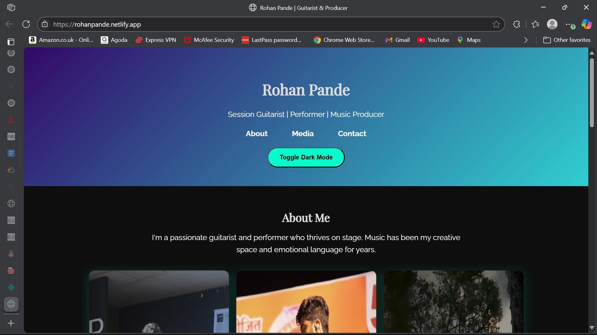

<h1 align="center">🎸 Rohan Pande - Portfolio 🎶</h1>

<p align="center">
  A modern, professional, and playful portfolio website for <strong>Rohan Pande</strong> — a session guitarist, music producer, and multi-instrumentalist.  
  <br/>
  <a href="https://rohanpande.netlify.app/"><strong>View Live Site »</strong></a>
</p>

---

## 📸 Screenshots
<p align="center">
  
  <br/>
  <em>Rohan Pande Portfolio Homepage</em>
</p>

---

## 🚀 Features
- 🎨 Modern UI with **Purple & Teal color scheme**
- 🌓 Dark mode toggle
- 🎥 Portfolio showcasing **audio & video work**
- 🎯 Hover effects & smooth scrolling animations
- 📱 Fully responsive design for all devices
- 📅 Scheduling integration for bookings

---

## 🛠 Tech Stack
- **Frontend:** HTML, CSS, JavaScript, React
- **Styling:** Tailwind CSS
- **Hosting:** Netlify
- **Integrations:** Google Analytics, Newsletter, Calendly

---

## 📦 Installation
```bash
# Clone the repository
git clone https://github.com/your-username/rohan-pande-portfolio.git

# Navigate to project folder
cd rohan-pande-portfolio

# Install dependencies
npm install

# Run the project locally
npm start

📝 Usage
Visit the live site to view portfolio work.

Use the Contact section or Booking feature to reach Rohan.

Explore audio and video showcase for samples.

📌 Roadmap
 Launch website

 Add more portfolio projects

 Add blog section for music tips

🤝 Contributing
Contributions are welcome!

Fork the repo

Create a branch (git checkout -b feature-name)

Commit changes (git commit -m 'Add feature')

Push to branch (git push origin feature-name)

Open a Pull Request

📜 License
This project is licensed under the MIT License.

💬 Connect
